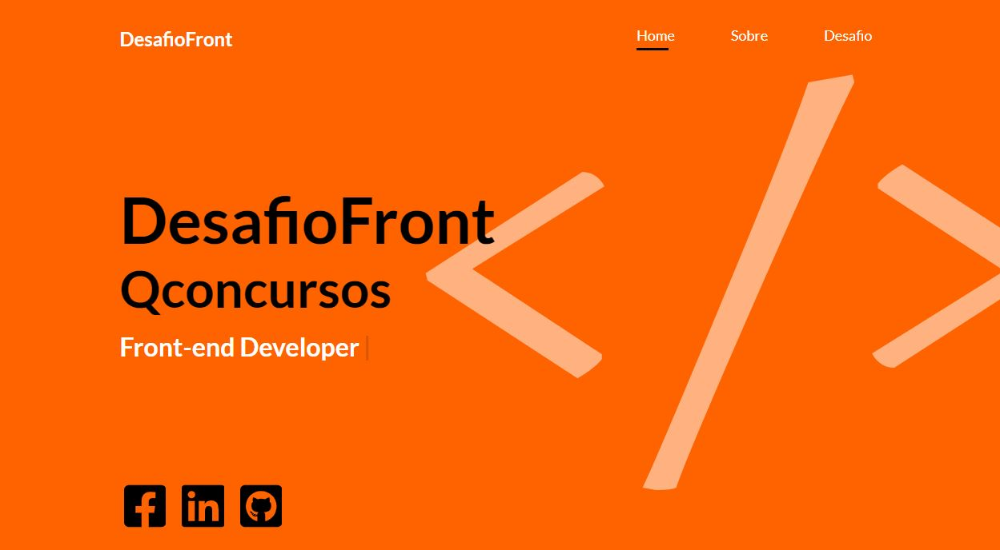

## Demostração Screenshot

<h1 align="center">
   
</h1>

## Demostração Video demostrativo

<h1 align="center">
   
</h1>


## Sobre o projeto

**Desafio** foi um projeto(Landing Page) criada para uma super vaga de Front-end na **QConcursos**, o projeto se resume em uma feature de consumo da API do **GITHUB** , que permite você buscar 


## Ferramentas

O projeto foi desenvolvido utilizando as seguintes tecnologias:

- **HTML5**
- **CSS3**
- **SASS**
- **Design Responsivo**
- **JavaScript Puro**
- **Consumo API**


## Para iniciar

```bash

    # clone repository
    $ git clone https://github.com/ViniciusMDuarte/desafio-frontend.git

    # Enter directory
    $ cd desafio-front end

    # abra a pasta public e abra index.html
    $ cd rode o projeto
    
```
